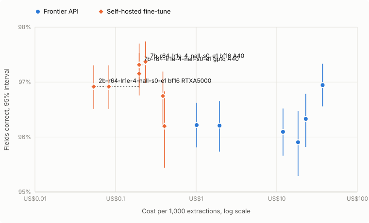

| Model | Prompt | Fields correct (95% CI) | Every field right | Paired delta vs openai/gpt-5.6-luna zero_shot | Cost per 1,000 | Latency p50 | p99 |
|---|---|---|---|---|---:|---:|---:|
| `openai/gpt-5.6-luna` | zero-shot | 96.2% (95.8% to 96.6%) | 58.3% (54.6% to 62.0%) | baseline | US$0.87 | 2.33 s | 4.95 s |
| `openai/gpt-5.6-luna` | few-shot | 96.2% (95.7% to 96.7%) | 60.4% (56.7% to 64.0%) | -0.0% (-0.3% to +0.3%) | US$1.62 | 2.17 s | 4.59 s |
| `anthropic/claude-sonnet-5` | zero-shot | 96.1% (95.7% to 96.5%) | 57.4% (53.8% to 61.0%) | -0.1% (-0.4% to +0.1%) | US$11.96 | 3.04 s | 8.95 s |
| `openai/gpt-5.6-sol` | zero-shot | 95.9% (95.3% to 96.5%) | 64.8% (61.3% to 68.4%) | -0.3% (-0.8% to +0.2%) | US$15.46 | 2.76 s | 6.49 s |
| `anthropic/claude-sonnet-5` | few-shot | 96.3% (95.8% to 96.8%) | 61.1% (57.4% to 64.7%) | +0.1% (-0.3% to +0.4%) | US$22.91 | 3.32 s | 9.86 s |
| `openai/gpt-5.6-sol` | few-shot | 96.9% (96.6% to 97.3%) | 67.0% (63.4% to 70.5%) | +0.7% (+0.5% to +1.0%) | US$30.43 | 2.92 s | 6.53 s |

Measured on 705 test_post_cutoff filings, US$58.69 of calls through the gateway.

**Where `openai/gpt-5.6-luna` zero_shot misses:**

| Field | Accuracy (95% CI) | How it missed |
|---|---|---|
| `cost_of_revenue` | 86.5% (84.0% to 89.1%) | hallucinated 82, missing 10, wrong_value 3 |
| `total_liabilities` | 90.5% (88.2% to 92.5%) | hallucinated 66, scale 1 |
| `eps_basic` | 91.9% (89.8% to 93.9%) | hallucinated 52, missing 4, wrong_period 1 |
| `shares_diluted` | 93.0% (91.1% to 94.9%) | hallucinated 31, scale 17, wrong_period 1 |
| `eps_diluted` | 94.5% (92.8% to 96.0%) | hallucinated 32, missing 4, sign 2, wrong_period 1 |
| `state_of_incorporation` | 94.9% (93.2% to 96.5%) | hallucinated 34, wrong_value 2 |
| `net_income` | 97.3% (96.0% to 98.4%) | wrong_value 16, wrong_period 2, scale 1 |
| `operating_income` | 98.2% (97.2% to 99.0%) | hallucinated 13 |
| `stockholders_equity` | 98.3% (97.3% to 99.1%) | wrong_value 5, missing 4, scale 3 |
| `fiscal_period` | 98.9% (98.0% to 99.6%) | wrong_value 8 |
| `cash_and_equivalents` | 99.7% (99.3% to 100.0%) | wrong_value 1, missing 1 |
| `auditor_name` | 99.7% (99.3% to 100.0%) | wrong_value 2 |
| `total_assets` | 99.9% (99.6% to 100.0%) | scale 1 |
| `period_end` | 100.0% (100.0% to 100.0%) | nothing |
| `revenue` | 100.0% (100.0% to 100.0%) | nothing |

Left out, as runs over part of the split rather than all of it: `luna-zero-smoke`.

| Model | Size | Format | Fields correct (95% CI) | Every field right | Paired delta vs openai/gpt-5.6-sol few_shot | Pre-cutoff minus post-cutoff |
|---|---|---|---|---|---|---|
| `2b-r64-lr1e-4-nall-s0-e1` | 2b | bf16 | 96.9% (96.5% to 97.3%) | 65.7% (62.1% to 69.1%) | -0.0% (-0.4% to +0.3%) | -1.8% (-2.3% to -1.2%) |
| `2b-r64-lr1e-4-nall-s0-e1` | 2b | gguf-q4_k_m | 96.2% (95.4% to 96.8%) | 64.4% (60.9% to 67.8%) | -0.7% (-1.5% to -0.2%) | not measured |
| `2b-r64-lr1e-4-nall-s0-e1` | 2b | gguf-q8_0 | 96.7% (96.2% to 97.2%) | 65.2% (61.7% to 68.7%) | -0.2% (-0.7% to +0.2%) | not measured |
| `2b-r64-lr1e-4-nall-s1-e1` | 2b | bf16 | 97.0% (96.5% to 97.4%) | 68.7% (65.1% to 72.1%) | +0.0% (-0.3% to +0.4%) | not measured |
| `2b-r64-lr1e-4-nall-s2-e1` | 2b | bf16 | 96.5% (96.1% to 97.0%) | 63.5% (59.9% to 67.0%) | -0.4% (-0.8% to -0.0%) | not measured |
| `4b-r16-lr2e-4-nall-s0-e1` | 4b | bf16 | 96.9% (96.5% to 97.3%) | 66.5% (63.0% to 69.9%) | -0.1% (-0.3% to +0.2%) | -1.8% (-2.4% to -1.3%) |
| `4b-r16-lr2e-4-nall-s0-e1` | 4b | gguf-q4_k_m | 0.1% (0.0% to 0.4%) | 0.0% (0.0% to 0.0%) | -96.8% (-97.3% to -96.3%) | not measured |
| `4b-r16-lr2e-4-nall-s0-e1` | 4b | gguf-q8_0 | 96.9% (96.5% to 97.3%) | 66.5% (63.0% to 69.9%) | -0.0% (-0.3% to +0.2%) | not measured |
| `4b-r16-lr2e-4-nall-s1-e1` | 4b | bf16 | 96.5% (96.1% to 96.9%) | 63.5% (59.9% to 67.1%) | -0.5% (-0.8% to -0.1%) | not measured |
| `4b-r16-lr2e-4-nall-s2-e1` | 4b | bf16 | 96.2% (95.7% to 96.7%) | 63.4% (59.9% to 67.0%) | -0.7% (-1.1% to -0.3%) | not measured |
| `7b-r64-lr1e-4-nall-s0-e1` | 7b | awq | 97.2% (96.8% to 97.5%) | 69.8% (66.2% to 73.0%) | +0.2% (-0.1% to +0.5%) | not measured |
| `7b-r64-lr1e-4-nall-s0-e1` | 7b | bf16 | 97.4% (97.0% to 97.7%) | 71.9% (68.5% to 75.2%) | +0.4% (+0.1% to +0.7%) | -1.3% (-1.9% to -0.8%) |
| `7b-r64-lr1e-4-nall-s0-e1` | 7b | gguf-q4_k_m | 97.3% (96.9% to 97.6%) | 71.2% (67.8% to 74.5%) | +0.3% (-0.0% to +0.7%) | not measured |
| `7b-r64-lr1e-4-nall-s0-e1` | 7b | gguf-q8_0 | 97.3% (96.9% to 97.7%) | 71.8% (68.4% to 75.0%) | +0.4% (+0.1% to +0.7%) | not measured |
| `7b-r64-lr1e-4-nall-s0-e1` | 7b | gptq | 97.3% (96.9% to 97.7%) | 71.6% (68.1% to 74.9%) | +0.4% (+0.0% to +0.7%) | not measured |
| `7b-r64-lr1e-4-nall-s1-e1` | 7b | bf16 | 97.1% (96.6% to 97.5%) | 70.2% (66.8% to 73.6%) | +0.1% (-0.3% to +0.5%) | not measured |
| `7b-r64-lr1e-4-nall-s2-e1` | 7b | bf16 | 97.2% (96.8% to 97.6%) | 71.8% (68.4% to 75.0%) | +0.3% (-0.0% to +0.6%) | not measured |

Measured on 705 test_post_cutoff filings, every call through the gateway, temperature as each run's manifest records it.

**Quantisation cost, paired over the same filings:**

| Model | Format | Accuracy delta vs bf16 (95% CI) | Worst field | Ships |
|---|---|---|---|---|
| `2b-r64-lr1e-4-nall-s0-e1` | gguf-q4_k_m | -0.7% (-1.4% to -0.2%) | `fiscal_period` -1.6% | no |
| `2b-r64-lr1e-4-nall-s0-e1` | gguf-q8_0 | -0.2% (-0.5% to +0.0%) | `fiscal_period` -0.4% | yes |
| `4b-r16-lr2e-4-nall-s0-e1` | gguf-q4_k_m | -96.8% (-97.2% to -96.3%) | `period_end` -99.9% | no |
| `4b-r16-lr2e-4-nall-s0-e1` | gguf-q8_0 | +0.0% (-0.1% to +0.1%) | `eps_diluted` -0.3% | yes |
| `7b-r64-lr1e-4-nall-s0-e1` | awq | -0.2% (-0.4% to -0.0%) | `operating_income` -0.7% | yes |
| `7b-r64-lr1e-4-nall-s0-e1` | gptq | -0.1% (-0.2% to +0.1%) | `net_income` -0.6% | yes |
| `7b-r64-lr1e-4-nall-s0-e1` | gguf-q4_k_m | -0.1% (-0.3% to +0.0%) | `net_income` -0.6% | yes |
| `7b-r64-lr1e-4-nall-s0-e1` | gguf-q8_0 | -0.0% (-0.1% to +0.0%) | `shares_diluted` -0.4% | yes |

| Model | Format | Accuracy delta vs bf16 (95% CI) | Req/s at c=32 | TTFT p99 ms | Cost per 1,000 | Break-even volume at 50% utilisation |
|---|---|---|---:|---:|---:|---:|
| `2b-r64-lr1e-4-nall-s0-e1` | bf16 | reference | 3.29 (3.29 to 3.29) | 3,628 (3,032 to 4,415) | US$0.083 (US$0.083 to US$0.083) | 0.4M |
| `2b-r64-lr1e-4-nall-s0-e1` | gguf-q4_k_m | -0.7% (-1.4% to -0.2%) | 0.67 (0.67 to 0.67) | 27,538 (21,364 to 30,202) | US$0.404 (US$0.404 to US$0.404) | 0.4M |
| `2b-r64-lr1e-4-nall-s0-e1` | gguf-q8_0 | -0.2% (-0.5% to +0.0%) | 0.70 (0.70 to 0.70) | 24,862 (18,454 to 28,287) | US$0.387 (US$0.387 to US$0.387) | 0.4M |
| `7b-r64-lr1e-4-nall-s0-e1` | awq | -0.2% (-0.4% to -0.0%) | 1.39 (1.39 to 1.39) | 11,107 (8,308 to 12,223) | US$0.196 (US$0.196 to US$0.196) | 0.4M |
| `7b-r64-lr1e-4-nall-s0-e1` | bf16 | reference | 1.16 (1.16 to 1.16) | 17,322 (16,672 to 17,468) | US$0.235 (US$0.235 to US$0.235) | 0.4M |
| `7b-r64-lr1e-4-nall-s0-e1` | gptq | -0.1% (-0.2% to +0.1%) | 1.39 (1.39 to 1.39) | 11,925 (8,543 to 12,351) | US$0.196 (US$0.196 to US$0.196) | 0.4M |

Self-hosted cost is the GPU-hour rate over the throughput measured at 32 requests in flight, at 50% utilisation; break-even is against `openai/gpt-5.6-luna zero_shot` at US$0.87 per 1,000, the cheapest frontier run, from the gateway ledger.

**Break-even, extractions a month, across utilisation:**

| Model | Format | GPU | 10% | 30% | 50% | 70% | 90% |
|---|---|---|---:|---:|---:|---:|---:|
| `2b-r64-lr1e-4-nall-s0-e1` | bf16 | A40 on_demand at runpod, US$0.490/h, checked 2026-09-26 | 0.4M | 0.4M | 0.4M | 0.4M | 0.4M |
| `2b-r64-lr1e-4-nall-s0-e1` | gguf-q4_k_m | A40 on_demand at runpod, US$0.490/h, checked 2026-09-26 | never | 0.4M | 0.4M | 0.4M | 0.4M |
| `2b-r64-lr1e-4-nall-s0-e1` | gguf-q8_0 | A40 on_demand at runpod, US$0.490/h, checked 2026-09-26 | never | 0.4M | 0.4M | 0.4M | 0.4M |
| `7b-r64-lr1e-4-nall-s0-e1` | awq | A40 on_demand at runpod, US$0.490/h, checked 2026-09-26 | never | 0.4M | 0.4M | 0.4M | 0.4M |
| `7b-r64-lr1e-4-nall-s0-e1` | bf16 | A40 on_demand at runpod, US$0.490/h, checked 2026-09-26 | never | 0.4M | 0.4M | 0.4M | 0.4M |
| `7b-r64-lr1e-4-nall-s0-e1` | gptq | A40 on_demand at runpod, US$0.490/h, checked 2026-09-26 | never | 0.4M | 0.4M | 0.4M | 0.4M |

